<!-- Animated banner with falling tech logos — commit banner.svg to the repo root and it will render here -->

# Hi there, I'm João Vitor Givisiez Lessa! 

### 💻 Computer Science Student

I'm an undergraduate student studying **Computer Science** at the **Federal University of Lavras (UFLA)**, currently working as a **Software Development Intern at Druid**, focused on Java and AWS. I have a broad practical background in software development — from full-stack applications to DevOps and cloud infrastructure — and I enjoy applying and expanding my knowledge across software engineering, data science, and intelligent solutions.

---

## 👨‍💻 About Me

- 💼 Working with **Java, Maven, Docker and AWS** on daily development, architecture and cloud deployments.
- 🔬 Undergraduate researcher in **AI, NLP and LLMs** — from human–robot interaction to autonomous agents.
- 🌱 Currently deepening my studies in **Data Science, Machine Learning** and **cloud architecture**.
- 💬 Comfortable working in agile teams and writing clear technical documentation, in Portuguese or English.

---

## 🛠️ Languages and Tools

### 💻 Languages

  

### ☁️ Cloud & DevOps

  
  

### 🧠 Data Science, AI & Machine Learning

  
  
  
  
  
  

### 🔧 Tools & Utilities

  
  

---

## 🌍 Connect with me

